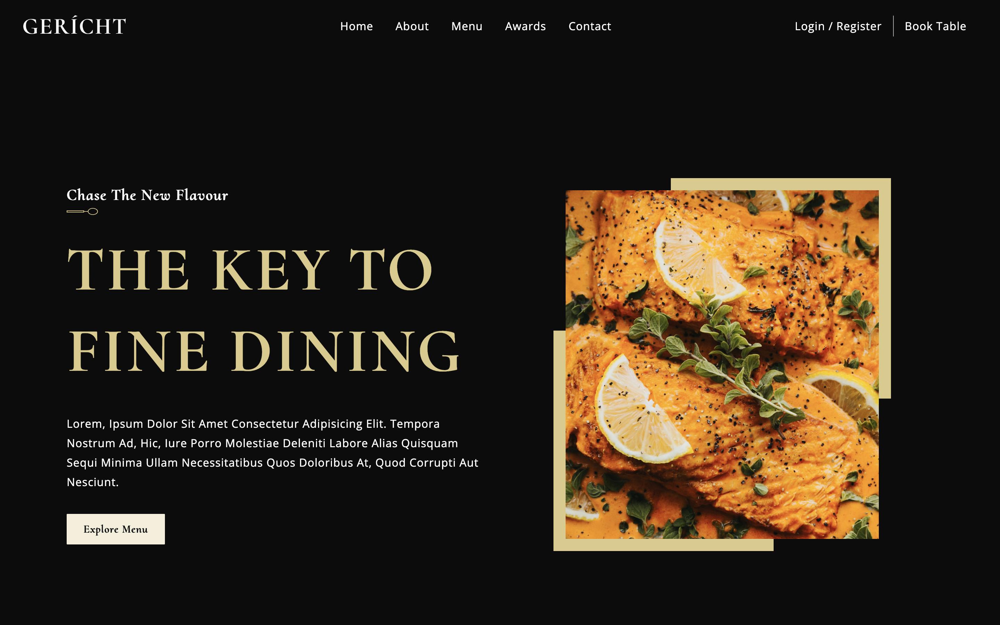

# Resturant Landing Page

This is a React single-page restaurant landing page website. This website have beautiful UI/UX design and is fully responsive.

## Screenshots



## Run Locally

Clone the project

```bash
  git clone https://github.com/akdevv/restaurant-landing-page.git
```

Go to the project directory

```bash
  cd restaurant-landing-page
```

Install dependencies

```bash
  npm install
```

Start the server

```bash
  npm run dev
```

## Credits

This project was made with help of tutorial from **JavaScript Mastery** YouTube channel. Video link [here](https://www.youtube.com/watch?v=4oV65GVVits)
